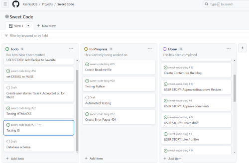

# **Sweet Code Blog**

**Developer: Ksenia Sossin**
* [View Sweet Code Blog Repository](https://github.com/KseniaSOS/sweet-code-blog)
* [View live website](https://.herokuapp.com/)

# Table of Content

* [**Project**](<#project>)
    * [Introduction](<#introduction>)
    * [Site Users Goal](<#site-users-goal>)
    * [Site Owners Goal](<#site-owners-goal>)
    * [Project Management](<#project-management>)

* [**User Experience (UX)**](<#user-experience-ux>)
    * [Wireframes](<#wireframes>)
    * [User Stories](<#user-stories>)
    * [Site Structure](<#site-structure>)
    * [Design Choices](<#design-choices>)

* [**Existing Features**](<#existing-features>)
    * [Navigation](<#navigation>)
    * [Home](<#home>)
    * [Recipe Detail View](<#recipe-detail-view>)
    * [Comment](<#comment>)
    * [About](<#about>)
    * [Create Recipe](<#create-recipe>)
    * [User Recipes](<#user-recipes>)    
    * [Update / Delete Recipe](<#update-and-delete-recipe>)    
    * [Category](<#category>)
    * [Add New Category](<#add-new-category>)    
    * [Sign Up](<#sign-up>)
    * [Sign In](<#sign-in>)
    * [Sign Out](<#sign-out>)
    * [Footer](<#footer>)
    * [Flash Messages](<#flash-messages-and-confirmation-pages-to-the-user>)

* [**Features Left To Implement**](<#features-left-to-implement>)

* [**Testing**](<#testing>)
    * [Testing User Stories](<#testing-user-stories>)
    * [Code Validation](<#code-validation>)
    * [Additional Testing](<#additional-testing>)
    * [Known Bugs](<#known-bugs>)

* [**Technologies Used**](<#technologies-used>)
    * [Languages](<#languages>)
    * [Frameworks & Software](<#frameworks--software>)
    * [Libraries](<#libraries>)

* [**Deployment**](<#deployment>)
* [**Credits**](<#credits>)
* [Acknowledgements](<#acknowledgements>)

# **Project**
## Introduction

Whether you're a seasoned chef, a weekend baker, or someone who just loves to dabble in the artof pastry making, then Sweet Code Blog  is for you!
Here, users can browse, create, and share recipes ranging from heavenly cakes and chocolates to exquisite pastries and sweets.  Add final recipe images, edit, refine and perfect your recipes anytime. To create a more interactive and lively site, users can comment and like on other users recipes. All comments and recipes need approval by Admin of Sweet Code Blog to secure a digital hangout where everyone can feel safe from abuse, inappropriate language, etc.

Sweet Code Blog was created for Portfolio Project #4 (Full-Stack Toolkit) - Diploma in Full Stack Software Development Diploma at the [Code Institute](https://www.codeinstitute.net). The data are stored in a ElefantSQL database.

## Site Users Goal

The user's goal is to be able to create their own recipes, edit and delete them. Browse recipes by category and find your own recipes just as quickly. Have the opportunity to like and comment on the recipes of other users and also see comments and likes on your recipes.

## Site Owners Goal

The website owner's goal is to create a website where users can intuitively browse the latest recipes. Monitor the approval of new recipes and comments. Maintain a safe environment on the site.

## Project Management

### Github Board

I've been using the project board in GitHub to keep my project together. It has been working really well and has helped me structure up my work a lot. GitHub was used to plan and organize my hole project and user stories.

<b>Github Board</b>

 

[Back to top](<#table-of-content>)

### Database Schema

Models used (besides standard user model) in this project are:

* **Category** - 
* **Recipe** - Handles all the recipes
* **Comment** - Handles all the comments

<b>Database Schema</b>

 

# **User Experience (UX)**

## Wireframes

<b>Wireframes</b>

 

## User Stories

### Site User

TABLE

### Site Admin

TABLE

[Back to top](<#table-of-content>)

## Site Structure

[Back to top](<#table-of-content>)

## Design Choices

* ### Color Scheme

* ### Typography

    * **Pacifico** - handwriting font for Logo
    * **PT Serif** - main body font
    

[Back to top](<#table-of-content>)

# **Features**

## **Existing Features**

### **Navigation**

### **Home**

### **Recipe Detail View**

### **Comment**

### **About**

### **Create Recipe**

### **User Recipes**

### **Update / Delete Recipe**

### **Category**

### **Add New Category**

### **Sign Up**

### **Sign In**

### **Sign Out**

### **Footer**

### **Flash Messages**

## **Features Left to Implement**

*
*
*
*

[Back to top](<#table-of-content>)

# Technologies Used
## Languages

* [Python](https://en.wikipedia.org/wiki/Python_(programming_language)) - Provides the functionality for the site.
* [HTML5](https://en.wikipedia.org/wiki/HTML) - Provides the content and structure for the website.
* [CSS](https://en.wikipedia.org/wiki/CSS) - Provides the styling for the website.
* [JavaScript](https://en.wikipedia.org/wiki/JavaScript) - Provides interactive elements of the website.

## Frameworks & Software

* [Bootstrap](https://getbootstrap.com/) - A CSS framework that helps building solid, responsive, mobile-first sites
* [Django](https://www.djangoproject.com/) - A model-view-template framework used to create the site
* [Balsamiq](https://balsamiq.com/) - Used to create the wireframe
* [Github](https://github.com/) - Used to host and edit the website
* [GitBash](https://en.wikipedia.org/wiki/Bash_(Unix_shell)) - Terminal in [Gitpod](https://www.gitpod.io) used to push changes to the GitHub repository
* [Heroku](https://en.wikipedia.org/wiki/Heroku) - A cloud platform that the application is deployed to
* [ElephantSQL](https://www.elephantsql.com/) - Provides a browser tool for SQL queries.
* [Lighthouse](https://developer.chrome.com/docs/lighthouse/overview/) - Used to test performance of site
* [Google Chrome DevTools](https://developer.chrome.com/docs/devtools/) - Used to debug and test responsiveness
* [Cloudinary](https://cloudinary.com/) - A service that hosts all static files in the project
* [HTML Validation](https://validator.w3.org/) - Used to validate HTML code
* [CSS Validation](https://jigsaw.w3.org/css-validator/) - Used to validate CSS code
* [PEP8 Validation](http://pep8online.com/) - Used to validate Python code
* [SmartDraw](https://app.smartdraw.com/) - Used for creating the Model Schema
* [Font Awesome](https://fontawesome.com/) - Used for icon features on the site
* [Google Fonts](https://fonts.google.com/) -
used to import fonts for the website
* [Tynypng](https://tinypng.com/) - Used for compressing all images
* [Am I Responsive?](https://ui.dev/amiresponsive) - Used for createing responsive deisign image

## Libraries

* [asgiref](https://pypi.org/project/asgiref/) - ASGI is a standard for Python asynchronous web apps and servers to communicate with each other, and positioned as an asynchronous successor to WSGI.
* [cloudinary](https://pypi.org/project/cloudinary/) - The Cloudinary Python SDK allows you to quickly and easily integrate your application with Cloudinary. Effortlessly optimize, transform, upload and manage your cloud's assets.
* [cryptography-3.4.8](https://pypi.org/project/cryptography/3.4/) - Cryptography is a package which provides cryptographic recipes and primitives to Python developers.
* [dj3-cloudinary-storage](https://pypi.org/project/dj3-cloudinary-storage/) - Django Cloudinary Storage is a Django package that facilitates integration with Cloudinary by implementing Django Storage API.
* [Django](https://pypi.org/project/Django/) - Django is a high-level Python web framework that encourages rapid development and clean, pragmatic design.
* [django-allauth](https://pypi.org/project/django-allauth/) - Integrated set of Django applications addressing authentication, registration, account management as well as 3rd party (social) account authentication.
* [django-crispy-forms](https://pypi.org/project/django-crispy-forms/) - Used to integrate Django DRY forms in the project.
* [gunicorn](https://pypi.org/project/gunicorn/) - Gunicorn ‘Green Unicorn’ is a Python WSGI HTTP Server for UNIX. It’s a pre-fork worker model ported from Ruby’s Unicorn project. The Gunicorn server is broadly compatible with various web frameworks, simply implemented, light on server resource usage, and fairly speedy.
* [oauthlib](https://pypi.org/project/oauthlib/) - OAuthLib is a framework which implements the logic of OAuth1 or OAuth2 without assuming a specific HTTP request object or web framework.
* [psycopg2](https://pypi.org/project/psycopg2/) - Psycopg is the most popular PostgreSQL database adapter for the Python programming language.
* [PyJWT](https://pypi.org/project/PyJWT/) - A Python implementation of RFC 7519.
* [python3-openid](https://pypi.org/project/python3-openid/) - OpenID support for modern servers and consumers.
* [pytz](https://pypi.org/project/pytz/) - This is a set of Python packages to support use of the OpenID decentralized identity system in your application, update to Python 3
* [requests-oauhlib](https://pypi.org/project/requests-oauthlib/) - P    rovides first-class OAuth library support for Requests.
* [sqlparse](https://pypi.org/project/sqlparse/) - sqlparse is a non-validating SQL parser for Python. It provides support for parsing, splitting and formatting SQL statements.

[Back to top](<#table-of-content>)

# Testing
## Testing User Stories

[Back to top](<#table-of-content>)

# Deployment
## Deployment To Heroku

**Requirement and Procfile**

Before deployment on Heroku, two files need to be created and be up to date, a `requirements.txt` file and a `Procfile`.

- The `requirements.txt` file is created by executing the following command in the terminal window: ` pip3 freeze --local > requirements.txt`. A file with all requirements will be created.
- Then create a file named `Procfile` and insert the following code: `web: gunicorn PROJ_NAME.wsgi?`, with no empty lines after it.
- Then make sure to push these files to your repository.

**Creating Heroku App**

- Log into Heroku and go to the Dashboard.
- Click "New" and then select "Create new app".
- Give your app a name and select the region closest to you.
- Click "Create app" to confirm.

**Creating a database**

- Log into ElephantSQL.com and access your dashboard.
- Click "Create New Instance"
- Set up a plan, give your plan a **Name**, select the **Tiny Turtel (Free)** plan, leave the **Tags** field blank.
- Select "Select Region" and select a data center new you.
- Click "Review".
- Confirm your details and then click "Create instance".
- Return to the ElephantSQL dashboard and click on the database instance name for this project.
- In the URL section, click the copy icon to copy the database URL.
- In your workspace make sure django and gunicorn are installed by running `pip3 install 'django<4' gunicorn`.
- Equally make sure that infrastructure for the database is installed by running `pip3 install dj_database_url===0.5.0 psycopg2`.
- Update the `requirements.txt` file if needed.

**The env.py file**

- If you do not have a `env.py` file in your workspace create one and make sure it is included in the `.gitignore` file.
- At the top of the `env.py` file add the line: `import os`.
- Below that add the following two lines:

  `os.environ["DATABASE_URL"] = "<copied URL from SQL database>"`  
  `os.environ["SECRET_KEY"] = "<create a secret key of your own>"`  

- If you are using Cloudinary storage also add the following line:  

  `os.environ["CLOUDINARY_URL"] = "<copied URL from Cloudinary account>"` 

- Make sure the environment variables are imported correctly into the `settings.py` file.
- Run `python manage.py migrate` in the terminal window to migrate the data structure to the database instance.

**Setting Environment Variables**

- On the Heroku Dashboard select the app you just created and then select the "Settings" tab.
- Click "Reveal Config Vars"
- Add the following config vars:  

  `DATABASE_URL` - copy the database URL from ElephantSQL in here, it should also be in the `env.py` file.  
  `SECRET_KEY` - copy your secret key in here.  

- If you are using Cloudinary storage you also need to copy your personal `CLOUDINARY_URL` into these fields.  
- In addition, you may need the key `PORT` with value `8000`.

**Connecting to GitHub and Deploy**

- On the Heroku Dashboard select the app you just created and then select the "Deploy" tab.
- Select GitHub for the deployment method.
- Search for the name of the project repository and click "Connect".
- Further down the page, select "Enable Automatic Deploys" if desired.
- Then finally further down, select "Deploy Branch" and watch the app being built.

### Forking the Repository

- Log in to GitHub and locate the GitHub repository you want to fork.
- At the top of the Repository above the "Settings" Tab on the menu, locate the "Fork" Button and click it.
- You will have a copy of the original repository in your GitHub account.
- You will now be able to make changes to the new version and keep the original safe.

### Making a Local Clone

- Log into GitHub and locate the repository you want to clone.
- Click the 'Code' dropdown above the file list.
- Copy the URL for the repository.
- Open Git Bash in your IDE.
- Change the current working directory to the location where you want the cloned directory.
- Type `git clone` in the CLI and then paste the URL you copied earlier. This is what it should look like:
  `$ git clone https://github.com/`
- Press Enter to create your local clone.

You will need to install all of the packages listed in the requirements file you can use the following command in the terminal `pip install -r requirements.txt` which will do it for you.

[Back to top](<#table-of-content>)

# Credits
* ## Content      
  * Recipes and text content of the site - **Ksenia Sossin**
  * Images - [DALL-E](https://openai.com/research/dall-e)
     

* ## Media

Resources and inspiration came from a few sources:

  * [Django Documentation](https://docs.djangoproject.com/en/4.2/)
  * [StackOverflow](https://stackoverflow.com/)
  * [Codemy.com](https://www.youtube.com/watch?v=B40bteAMM_M&list=PLCC34OHNcOtr025c1kHSPrnP18YPB-NFi) - YouTube tutorial
  * [I Think Therefore I Blog](https://github.com/Code-Institute-Solutions/Django3blog) - based on the project by the Code Institute 
  * [Viva la nacho](http://viva-la-nacho.herokuapp.com/) - inspiration by past CI projects 

[Back to top](<#table-of-content>)

# Acknowledgements

I would like to acknowledge the [Code Institute](https://codeinstitute.net/) for the opportunity to work on such a project.
It has been a challenging experience, but I have learned a lot.
Special thanks goes to my family for their continued support and patience.

[Back to top](<#table-of-content>)
