# *Sweet Code Blog*

**Developer: Ksenia Sossin**
* [View Sweet Code Blog Repository](https://github.com/KseniaSOS/sweet-code-blog)
* [View live website](https://.herokuapp.com/)

# Table of Content

* [**Project**](<#project>)
    * [Introduction](<#introduction>)
    * [Site Users Goal](<#site-users-goal>)
    * [Site Owners Goal](<#site-owners-goal>)
    * [Project Management](<#project-management>)

* [**User Experience (UX)**](<#user-experience-ux>)
    * [Wireframes](<#wireframes>)
    * [User Stories](<#user-stories>)
    * [Site Structure](<#site-structure>)
    * [Design Choices](<#design-choices>)

* [**Existing Features**](<#existing-features>)
    * [Navigation](<#navigation>)
    * [Home](<#home>)
    * [Hero Image](<#hero-image>)
    * [Recipe Detail View](<#recipe-detail-view>)
    * [Comment](<#comment>)
    * [About](<#about>)
    * [User Recipes](<#user-recipes>)
    * [Create Recipe](<#create-recipe>)        
    * [Update / Delete Recipe](<#update-and-delete-recipe>)    
    * [Category](<#category>)
    * [Add New Category](<#add-new-category>)    
    * [Sign Up](<#sign-up>)
    * [Sign In](<#sign-in>)
    * [Sign Out](<#sign-out>)
    * [Footer](<#footer>)
    * [Flash Messages](<#flash-messages-and-confirmation-pages-to-the-user>)

* [**Features Left To Implement**](<#features-left-to-implement>)

* [**Testing**](<#testing>)
    * [Testing User Stories](<#testing-user-stories>)
    * [Code Validation](<#code-validation>)
    * [Additional Testing](<#additional-testing>)
    * [Known Bugs](<#known-bugs>)

* [**Technologies Used**](<#technologies-used>)
    * [Languages](<#languages>)
    * [Frameworks & Software](<#frameworks--software>)
    * [Libraries](<#libraries>)

* [**Deployment**](<#deployment>)
* [**Credits**](<#credits>)
* [Acknowledgements](<#acknowledgements>)

# **Project**
## Introduction

Whether you're a seasoned chef, a weekend baker, or someone who just loves to dabble in the artof pastry making, then Sweet Code Blog  is for you!
Here, users can browse, create, and share recipes ranging from heavenly cakes and chocolates to exquisite pastries and sweets.  Add final recipe images, edit, refine and perfect your recipes anytime. To create a more interactive and lively site, users can comment and like on other users recipes. All comments and recipes need approval by Admin of Sweet Code Blog to secure a digital hangout where everyone can feel safe from abuse, inappropriate language, etc.

Sweet Code Blog was created for Portfolio Project #4 (Full-Stack Toolkit) - Diploma in Full Stack Software Development Diploma at the [Code Institute](https://www.codeinstitute.net). The data are stored in a ElefantSQL database.

## Site Users Goal

The user's goal is to be able to create their own recipes, edit and delete them. Browse recipes by category and find your own recipes just as quickly. Have the opportunity to like and comment on the recipes of other users and also see comments and likes on your recipes.

## Site Owners Goal

The website owner's goal is to create a website where users can intuitively browse the latest recipes. Monitor the approval of new recipes and comments. Maintain a safe environment on the site.

## Project Management
### Github Board

I've been using the [project board](https://github.com/users/KseniaSOS/projects/6) in GitHub to keep my project together. It has been working really well and has helped me structure up my work a lot. GitHub was used to plan and organize my hole project and user stories.

<b>Github Board</b>

 

### Database Schema

I used the SmartDraw modelling tool to create the database schema. it shows the relationships between the different models in the database connected to the application.

Models used (besides standard user model) in this project are:

* **Category** - stores all categories, that the admin adds.
* **Recipe** - stores the details of each recipe that a user adds.
* **Comment** - Handles all the comments

<b>Database Schema</b>

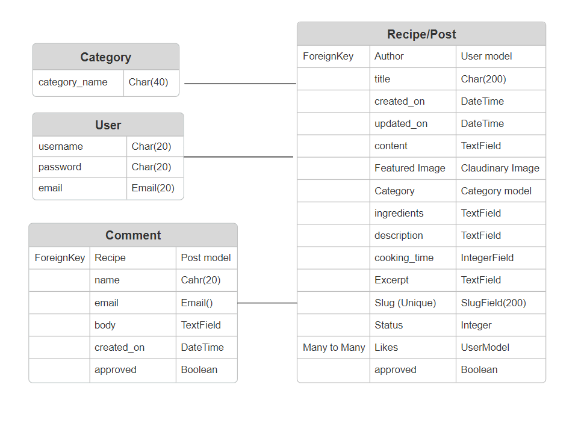

 

[Back to top](<#table-of-content>)

# **User Experience (UX)**

## Wireframes

The wireframes were produced in Balsamiq. There are frames for a full width display, tablets and a small mobile device.

<b>Wireframes</b>

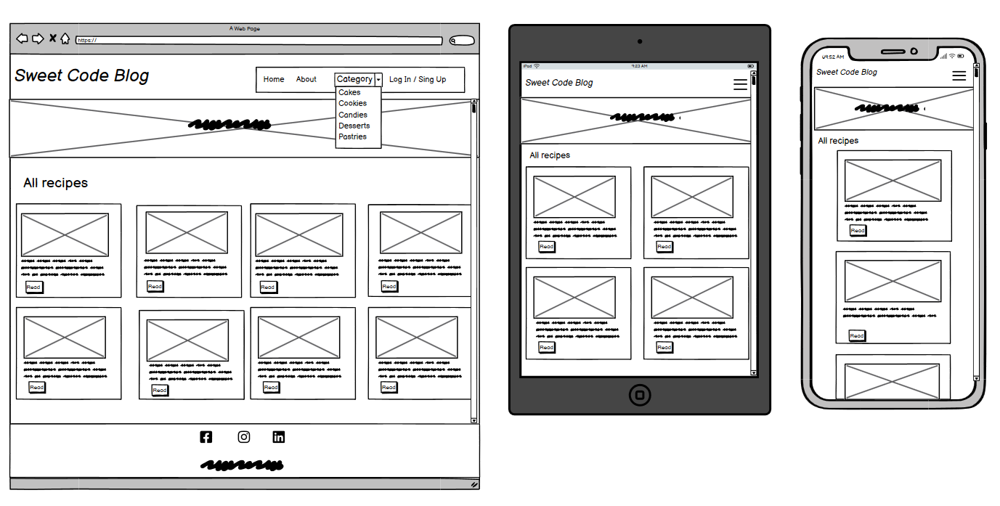

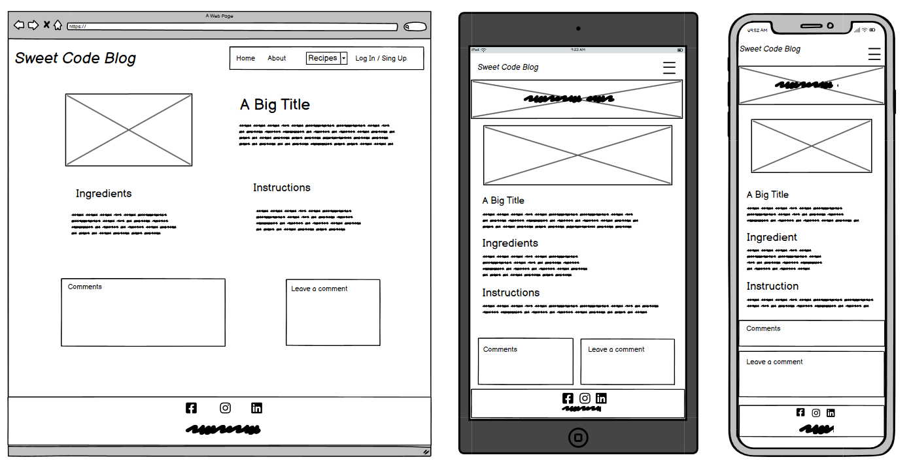

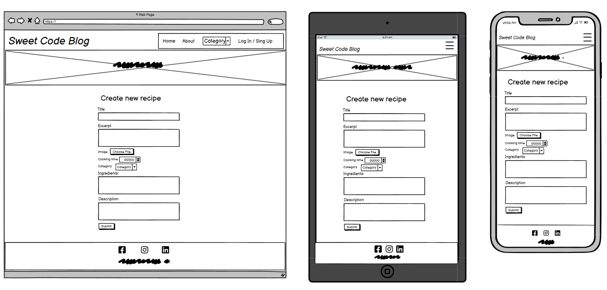

 

## User Stories
### Site User

|  | | |
|:-------:|:--------|:--------|
| As a Site User | I can view a list of the recipes so that I can select one to read| &check; |
| As a Site User | I can I can click on a recipe so that I can read the full content.| &check; |
| As a Site User | I can easily create a profile so that I can post recipes to the blog, comment and like on other recipes| &check; |
| As a Site User | I can login to my registered account so that access create posts, the comment and like functionality| &check; |
| As a Site User | I can view recipe sorted by category so that I can narrow my search and focus on a particular category of personal interest. | &check; |
| As a Site User |I can view comments on an individual post so that I can read the conversation | &check; |
| As a Site User | I can view the number of likes on each recipe so that I can see which is the most popular or viral. | &check; |
| As an authenticated  Site User | I can logout of my registered account so that keep my account safe from other users. | &check; |
| As an authenticated  Site User | I can like or unlike a recipe so that I can interact with the content | &check; |
| As an authenticated Site User | I can view my personal page with recipes so that I can view my own content concisely and access it for the purpose of editing. | &check; |
| As an authenticated Site User | I can leave comments on a recipe so that I can be involved in the conversation | &check; |
| As an authenticated Site User | I can create, read, update and delete my own Recipes so that I can contribute new content to the Sweet Code Blog and have a full control of my Recipes. | &check; |

### Site Admin

|  | | |
|:-------:|:--------|:--------|
| As a Site Admin |  I can create, read, update and delete Recipes so that I can manage my blog content.| &check; |
| As a Site Admin | I can create draft so that to finalize content writing at a later date. | &check; |
| As a Site Admin | I can approve or disapprove comments so that I can filter out objectionable comments.| &check; |
| As a Site Admin | I can add a new category so that all users of the site could filter recipes on a particular category | &check; |
| As a Site Admin | I can approve or disapprove recipes so that I can check the validity and the content of the recipes. | &check; |

[Back to top](<#table-of-content>)

## Site Structure

The Sweet Code Blog has an minimalistic, clean and intuitive design that makes the site easy to navigate for the user. The site is visible for two types of users: when **the user is logged out** and when **the user is logged in**.

Current pages:

  * Home 
  * About
  * Category
  * Recipe detail view
  * Create/ Update recipe *(just for authenticated user)*
  * View my recipes *(just for authenticated user)*
  * Add new category *(just for admin)*
  * SignUp/ LogIn / LogOut

Read more details about different pages in the [Features](<#features>) section.

[Back to top](<#table-of-content>)

## Design Choices
### Color Scheme

The color scheme chosen for the *Sweet Code Blog* was based on the Bootstrap light background. 
Colors: *#FFEEDC* is used as a background on recipe cards and as a comment background, *#B6452C* is used to highlight the recipe category and buttons, *#523634* in main text elements, and white is used as a background, for example. When choosing colors, I wanted to convey the rich colors of the cream and different shades of chocolate.

### Typography

**Pacifico** - is an original and fun brush script handwriting font for the logo of the site.
  

<b>Logo font</b>

 

**PT Serif** - used for all text on the site, including headings and links. It is a neutral font that is clearly visible and easy to read. It does not distract attention from the content.

<b>Main font</b>

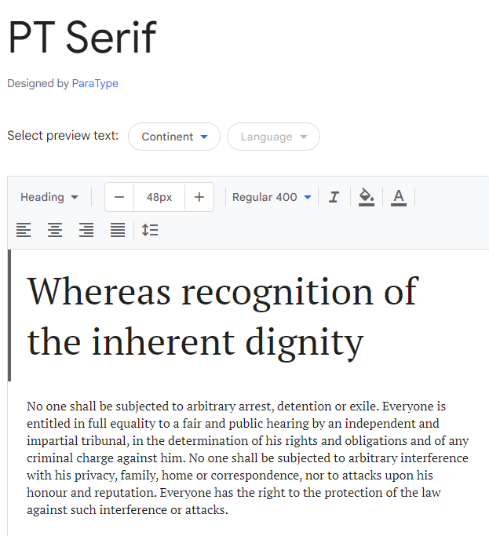

     

[Back to top](<#table-of-content>)

# **Features**
## **Existing Features**

### **Navigation**

There is a simple navbar with logo and link of different pages. Depending on whether the user is authenticated or not, different menus are visible for the site user. An extra menu item is visible if user is logged in as an administrator.

*Visible links to logged out users:*

* Home -  a list of all published recipes for the user to browse
* About - includes information about Sweet Code Blog
* Category - a dropdown menu for recipe categories
* Login / Sign Up - Gives the user the opportunity to log in or sign up if not ready a registered user

<b>Navigation Large - User Not Logged In</b>

 

<b>Navigation Small - User Not Logged In</b>

 

*Visible links to logged in users:*

All of the links that are visible to not authenticated users plus an extra dropdown menu with more links.

* Create New Recipe - allows the user to create a new recipe
* View My Recipes - lists all recipes created by the logged in user.
* Log Out - Logs out the user.

<b>Navigation Large - User Logged In</b>

 

<b>Navigation Small - User Logged In</b>

 

*Visible links if user is administrator:*

All of the links above plus the one below.

* Add new Category - allows to admin to create a new category for the site

<b>Navigation Large - Admin Logged In</b>

 

<b>Navigation Small - Admin Logged In</b>

 

### **Hero Image**

All pages are accompanied by a carousel hero with a welcome text. The carousel animates hero images with a smooth transition instead of a slide.

<b>Hero image</b>

 

### **Home**

The Home page is a list of published recipes. Individual recipe cards feature an image, a title, a date of creation an author, number of likes, a short excert and a button to view a detail recipe.

<b>All recipes</b>

 

### **Recipe Detail View**

The detail view of the recipes is available for all users of the site. The Page contains all information from the cards but also cooking time,  ingredients and instructions.

<b>Recipe Detail View page</b>

 

### **Comment**

All registered users can leave a comment, which should be first approved by the admin.

<b>Comment section for Logged In users</b>

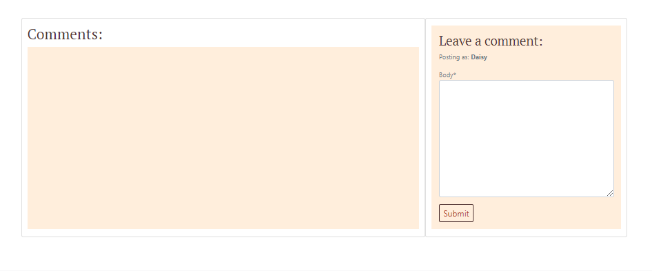

 

Unregistered users will see a message inviting them to register to join the discussion.

<b>Comment section for not Logged In users</b>

 

### **About**

On the About page, all users can read about the site, its goals and capabilities.

<b>About page</b>

 

### **User Recipes**

On the navbar *View my recipes*, the registered user can open a page, which lists users own recipes. The user can view, update them or delete.

<b>User Recipes</b>

 

### **Create Recipe**

On this page all logged in users can create their own recipes by filling the form. When the form is submitted, it needs to be approved by the administrator. Until it's approved it will not be displayd on the site for the public.

<b>Create Recipe</b>

 

### **Update / Delete Recipe**

On this page the logged in users can update their own recipes. When the form is updated, it will be sent to re-approvement. Until it's re-approved it will not be displayed on the site for the public.

<b>Update Recipe</b>

 

All recipes can be deleted, by their own author. The page is a confirmation, if User wants to delete the Recipe.

<b>Delete Recipe</b>

 

### **Category**

All user can open a page with a list of all published recipes dependent on the chosen category.

<b>Category</b>

 

### **Add New Category**

The administrator can add a new category, which will be added and displayed on the dropdown menu and in the form.

<b>Add New Category</b>

 

### **Sign Up**

If the site visitor has no registered user at Sweet Code Blog they have an opportunity to sign up. 

<b>Sign Up</b>

 

### **Sign In**

On this page all registered users can sign in.

<b>Sign In</b>

 

### **Sign Out**

Before sign out the site completely, users will be shown a page where they need to confirm their exit.

<b>Sign Out</b>

 

### **Footer**

The footer area includes name of the site *Sweet Code Blog*, social media icons via links and the name of the developer.

<b>Footer</b>

 

### **Flash Messages**

The sites incorporates flash messages and confirmation pages when an action has been performed (i.e. delete/update actions).

<b>Confirmation Messages</b>

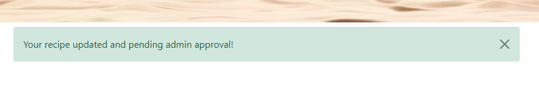

 

## **Features Left to Implement**

* Create a Profile Page
* Add admin panel to the website pages
* List of Favorites Feature
* Delete Account Feature
* Retrieve Password Feature

[Back to top](<#table-of-content>)

# Technologies Used
## Languages

* [Python](https://en.wikipedia.org/wiki/Python_(programming_language)) - Provides the functionality for the site.
* [HTML5](https://en.wikipedia.org/wiki/HTML) - Provides the content and structure for the website.
* [CSS](https://en.wikipedia.org/wiki/CSS) - Provides the styling for the website.
* [JavaScript](https://en.wikipedia.org/wiki/JavaScript) - Provides interactive elements of the website.

## Frameworks & Software

* [Bootstrap](https://getbootstrap.com/) - A CSS framework that helps building solid, responsive, mobile-first sites
* [Django](https://www.djangoproject.com/) - A model-view-template framework used to create the site
* [Balsamiq](https://balsamiq.com/) - Used to create the wireframe
* [Github](https://github.com/) - Used to host and edit the website
* [GitBash](https://en.wikipedia.org/wiki/Bash_(Unix_shell)) - Terminal in [Gitpod](https://www.gitpod.io) used to push changes to the GitHub repository
* [Heroku](https://en.wikipedia.org/wiki/Heroku) - A cloud platform that the application is deployed to
* [ElephantSQL](https://www.elephantsql.com/) - Provides a browser tool for SQL queries.
* [Lighthouse](https://developer.chrome.com/docs/lighthouse/overview/) - Used to test performance of site
* [Google Chrome DevTools](https://developer.chrome.com/docs/devtools/) - Used to debug and test responsiveness
* [Cloudinary](https://cloudinary.com/) - A service that hosts all static files in the project
* [HTML Validation](https://validator.w3.org/) - Used to validate HTML code
* [CSS Validation](https://jigsaw.w3.org/css-validator/) - Used to validate CSS code
* [PEP8 Validation](https://pep8ci.herokuapp.com/) - Used to validate Python code
* [SmartDraw](https://app.smartdraw.com/) - Used for creating the Model Schema
* [Font Awesome](https://fontawesome.com/) - Used for icon features on the site
* [Google Fonts](https://fonts.google.com/) -
used to import fonts for the website
* [Tynypng](https://tinypng.com/) - Used for compressing all images
* [Am I Responsive?](https://ui.dev/amiresponsive) - Used for createing responsive deisign image

## Libraries

* [asgiref](https://pypi.org/project/asgiref/) - ASGI is a standard for Python asynchronous web apps and servers to communicate with each other, and positioned as an asynchronous successor to WSGI.
* [cloudinary](https://pypi.org/project/cloudinary/) - The Cloudinary Python SDK allows you to quickly and easily integrate your application with Cloudinary. Effortlessly optimize, transform, upload and manage your cloud's assets.
* [cryptography-3.4.8](https://pypi.org/project/cryptography/3.4/) - Cryptography is a package which provides cryptographic recipes and primitives to Python developers.
* [dj3-cloudinary-storage](https://pypi.org/project/dj3-cloudinary-storage/) - Django Cloudinary Storage is a Django package that facilitates integration with Cloudinary by implementing Django Storage API.
* [Django](https://pypi.org/project/Django/) - Django is a high-level Python web framework that encourages rapid development and clean, pragmatic design.
* [django-allauth](https://pypi.org/project/django-allauth/) - Integrated set of Django applications addressing authentication, registration, account management as well as 3rd party (social) account authentication.
* [django-crispy-forms](https://pypi.org/project/django-crispy-forms/) - Used to integrate Django DRY forms in the project.
* [gunicorn](https://pypi.org/project/gunicorn/) - Gunicorn ‘Green Unicorn’ is a Python WSGI HTTP Server for UNIX. It’s a pre-fork worker model ported from Ruby’s Unicorn project. The Gunicorn server is broadly compatible with various web frameworks, simply implemented, light on server resource usage, and fairly speedy.
* [oauthlib](https://pypi.org/project/oauthlib/) - OAuthLib is a framework which implements the logic of OAuth1 or OAuth2 without assuming a specific HTTP request object or web framework.
* [psycopg2](https://pypi.org/project/psycopg2/) - Psycopg is the most popular PostgreSQL database adapter for the Python programming language.
* [PyJWT](https://pypi.org/project/PyJWT/) - A Python implementation of RFC 7519.
* [python3-openid](https://pypi.org/project/python3-openid/) - OpenID support for modern servers and consumers.
* [pytz](https://pypi.org/project/pytz/) - This is a set of Python packages to support use of the OpenID decentralized identity system in your application, update to Python 3
* [requests-oauhlib](https://pypi.org/project/requests-oauthlib/) - P    rovides first-class OAuth library support for Requests.
* [sqlparse](https://pypi.org/project/sqlparse/) - sqlparse is a non-validating SQL parser for Python. It provides support for parsing, splitting and formatting SQL statements.

[Back to top](<#table-of-content>)

# Testing
## Testing User Stories

|  | | |
|:-------:|:--------|:--------|
| As a Site User I can view a list of the recipes so that I can select one to read| Any user can go to the home page and see all publicly available recipes |
| As a Site User I can I can click on a recipe so that I can read the full content| All recipes are displayed as cards with brief information and a recipe view button that allows any user to open a detailed recipe |
| As a Site User I can easily create a profile so that I can post recipes to the blog, comment and like on other recipes| In the navigation bar the user can click the Login / Sign up link to either login or sign up for a new account |
| As a Site User I can login to my registered account so that access create posts, the comment and like functionality| A registered user I can click the Login / Sign up link and easily log in |
| As a Site User I can view recipes sorted by category so that I can narrow my search and focus on a particular category of personal interest. | There is a category link in the navigation bar so that each user can select a specific category. In addition, each recipe has a link to the category name by which you can also sort the recipes |
| As a Site User I can view comments on an individual post so that I can read the conversation | When a user opens a detailed recipe, all comments can be viewed |
| As a Site User I can view the number of likes on each recipe so that I can see which is the most popular or viral. |Likes can be seen on the  recipe cards and on the detailed recipe page |
| As an authenticated  Site User  I can logout of my registered account so that keep my account safe from other users. | A a registered user will see a 'Log out' link in the navigation bar, click on this and a page opens which will request confirmation from the user to log out. |
| As an authenticated  Site User I can like or unlike a recipe so that I can interact with the content | When the user is logged in it is possible to click on a thumps on the recipe detail page to like / unlike a recipe |
| As an authenticated Site User I can view my personal page with recipes so that I can view my own content concisely and access it for the purpose of editing. | In the navigation bar is a 'view my recipes' link, where alle registered users can see all their recipes. There will be shown a list with recipe cards and three buttons : view recipe / update/ delete |
| As an authenticated Site User I can leave comments on a recipe so that I can be involved in the conversation | Each page with detailed recipe has a comment section, if user is logged in, they can freely comment on recipe |
| As an authenticated Site User I can create, read, update and delete my own Recipes so that I can contribute new content to the Sweet Code Blog and have a full control of my Recipes. | Every registered user can see the "Create New Recipe" link in the navigation bar that opens the form. After submitting the form, the user will receive a message that the recipe has been created and needs administrator approval. The "view my recipes" link allows the user to update or delete their published recipes |
| As a Site Admin I can create, read, update and delete Recipes so that I can manage my blog content.| Creation / updation / deletion of own recipes can be made the same way as any logged in user. In the admin panel admin has the whole control of all recipes on the site |
| As a Site Admin I can create draft so that to finalize content writing at a later date. | In the admin panel, admin has a possibility to set the status on the recipes either on published or draft |
| As a Site Admin I can approve or disapprove comments so that I can filter out objectionable comments.| In the admin panel admin has the whole control of all recipes on the site. Admin can approve or unapprove comments |
| As a Site Admin I can approve or disapprove recipes so that I can check the validity and the content of the recipes. | In the admin panel admin has the whole control of all recipes on the site. Admin can approve / unapprove / publish / unpublish recipes.   |
| As a Site Admin  I can add a new category so that all users of the site could filter recipes on a particular category | As a logged in admin, there will be an 'add new category' link in the navbar, so admin can easily create a new category for the site, which doesn't need an extra approval from the admin panel |

[Back to top](<#table-of-content>)

## Code Validation
### Markup Validation

The website Sweet Code Blog was valdated by [W3C html Validator](https://validator.w3.org/). The validation showed errors in the code of Summernote editor that was used on the site. Unsolved bug are described in [Known Bugs](<#known-bugs>) section. The rest of the pages were without errors.

<b>HTML Validation Result</b>

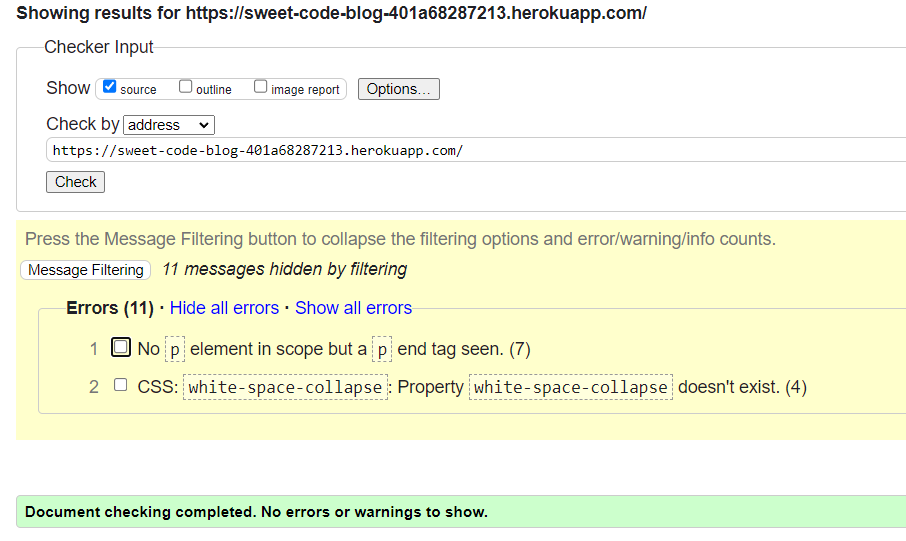

 

### CSS Validaton

The CSS have been run through the [W3C CSS Validator](https://jigsaw.w3.org/css-validator/), which reports no errors.

<b>CSS Validation Result</b>

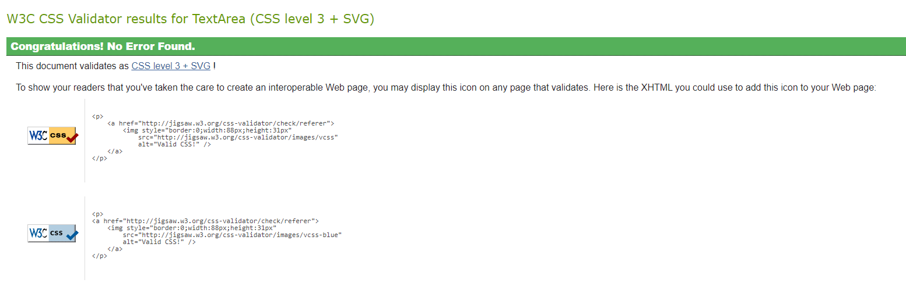

 

### JavaScript Validation

[JSHint](https://jshint.com/) was used to validate the JavaScript of the website, which consists only of one function at the end of the base.html files.

<b>JSHint Validation Result</b>

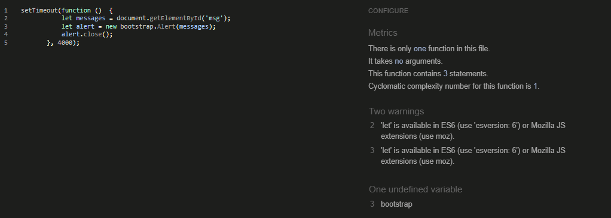

 

### PEP Validation

The Python code was tested using the [CI Python Linter](https://pep8ci.herokuapp.com/). I have tested the following Python files:

* admin.py - No errors or warnings reported
* forms.py - No errors or warnings reported
* models.py - No errors or warnings reported
* urls.py - No errors or warnings reported
* views.py - No errors or warnings reported

<b>PEP8 Validation Result</b>

 

[Back to top](<#table-of-content>)

## Additional Testing
### Manual Testing

TABLE

### Responsiveness Test

## Responsiveness Test

* The responsive design tests were carried out manually with [Google Chrome DevTools](https://developer.chrome.com/docs/devtools/) and [Responsive Design Checker](https://www.responsivedesignchecker.com/).

|        | Nexus 4 | Galaxy S5 | iPhone 3/4 | iPad Mini | iPad Pro | Display <1600px | Display >1600px |
|--------|---------|-----------|------------|-----------|----------|-----------------|-----------------|
| Render | pass    | pass      | pass       | pass      | pass     | pass            | pass            |
| Images | pass    | pass      | pass       | pass      | pass     | pass            | pass            |
| Links  | pass    | pass      | pass       | pass      | pass     | pass            | pass            |

### Browser Compatibility

* Google Chrome Version 
* Apple Safari 
* Microsoft Edge 

[Back to top](<#table-of-content>)

### Lighthouse

Google Lighthouse was used to test website performance. Due to the large number and quality of images, performance usually receives a relatively poor rating on the mobile version. On the desktop version, all other parameters are highly rated.

<b>Lighthouse</b>

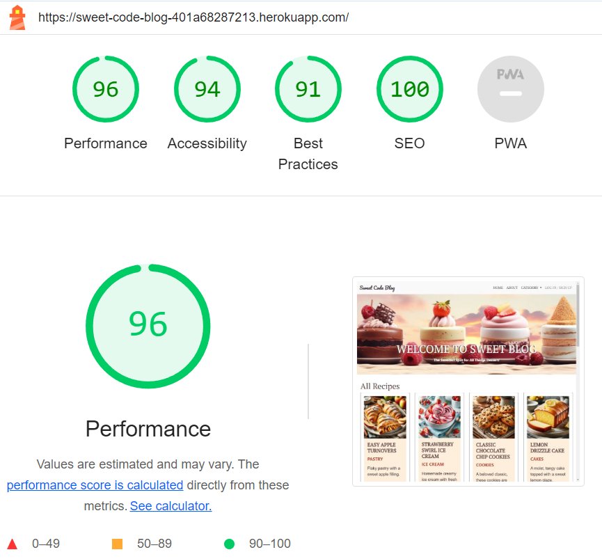

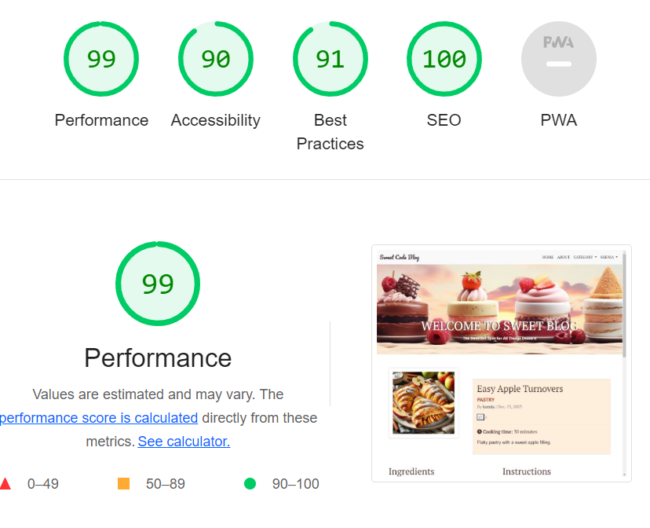

 

<b>Lighthouse Mobile</b>

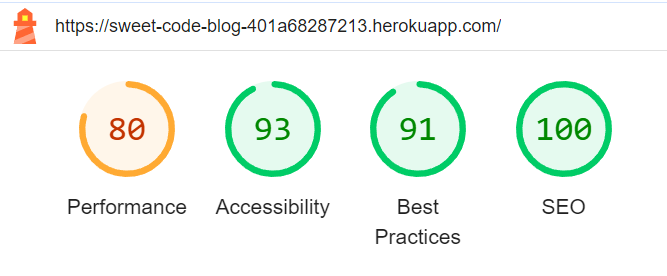

 

### WAVE

[WAVE](https://wave.webaim.org/) was used to check accessibility. There are 2 Contrast Errors of caption on the hero image.

<b>WAVE Result</b>

 

## Known bugs
### Fixed Bugs

* Ecxerpt has html tags when submitting the recipe form.
  * Add the helper method *save* to slugify and save the slug.

    

<b>Excerpt bug</b>

    
    
 
 
* Create a recipe page was displaying for unregistered users who accessed it with the URL directly.
  * Add LoginRequiredMixin to all views that should be accessible only to users who are logged in.

* The 'Category' dropdown menu would not populate on all pages.
  * Add the following line of code to the context_processors in the settings.py file: 'blog.views.category_menu_context_processor'.

* There was a bug with unapproved recipes, which were displayed on the home page.
  * Add unapprove function to admin.py. Updated recipes schould be approved from admin panel. Just approved recipes will be displayed on the main recipe_list page (base.html).
  
### Unfixed Bugs

Bugs were found during the validation and a brief description is provided below:

* **Sign In page**

  Bug: the “forgot password” line on the login page was not removed, although it was removed from the template. I found a solution in Slack: django-allauth should be downgraded to django-allauth==0.51.0, promising that older versions of templates will not cause problems. But unfortunately I had another problem with WISGI and with the help of a tutor we were not able to solve this problem. So my project uses the new version of alluth and the line stays there. And if you don’t want to use “password reset” in future projects, then you need to use an older version of django-allauth.

  

<b>Sig In page</b>

  
  
 

  

<b>django-allauth</b>

  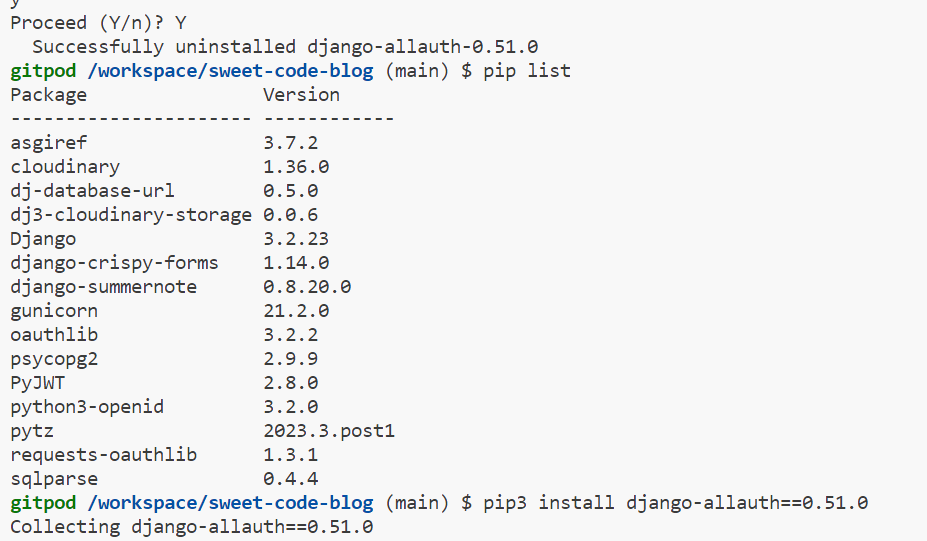
  
 

  

<b>Wisgi bug</b>

  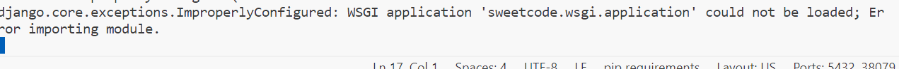
  
 

*  **Summernote** 

    Bug: When using the Summernote editor in a project, it turned out that it does not work properly. The problem is that when the user fills out the form, in this case creating a recipe, the program allows you to select font settings and so on. This creates to W3C validator errors as the program creates its own paragraph tags and style. This bug is still not fixed and I haven't found a solution yet.

    

<b>The W3C Markup Validator</b>

    
    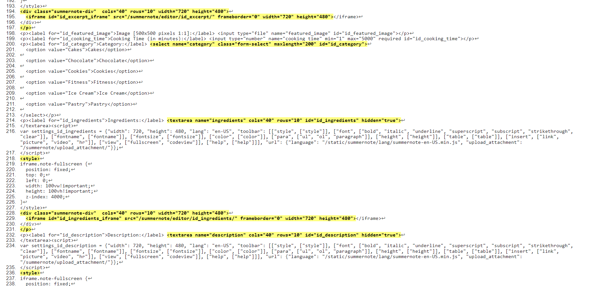
    
 

  

[Back to top](<#table-of-content>)

# Deployment
## Deployment To Heroku

**Requirement and Procfile**

Before deployment on Heroku, two files need to be created and be up to date, a `requirements.txt` file and a `Procfile`.

- The `requirements.txt` file is created by executing the following command in the terminal window: ` pip3 freeze --local > requirements.txt`. A file with all requirements will be created.
- Then create a file named `Procfile` and insert the following code: `web: gunicorn PROJ_NAME.wsgi?`, with no empty lines after it.
- Then make sure to push these files to your repository.

**Creating Heroku App**

- Log into Heroku and go to the Dashboard.
- Click "New" and then select "Create new app".
- Give your app a name and select the region closest to you.
- Click "Create app" to confirm.

**Creating a database**

- Log into ElephantSQL.com and access your dashboard.
- Click "Create New Instance"
- Set up a plan, give your plan a **Name**, select the **Tiny Turtel (Free)** plan, leave the **Tags** field blank.
- Select "Select Region" and select a data center new you.
- Click "Review".
- Confirm your details and then click "Create instance".
- Return to the ElephantSQL dashboard and click on the database instance name for this project.
- In the URL section, click the copy icon to copy the database URL.
- In your workspace make sure django and gunicorn are installed by running `pip3 install 'django<4' gunicorn`.
- Equally make sure that infrastructure for the database is installed by running `pip3 install dj_database_url===0.5.0 psycopg2`.
- Update the `requirements.txt` file if needed.

**The env.py file**

- If you do not have a `env.py` file in your workspace create one and make sure it is included in the `.gitignore` file.
- At the top of the `env.py` file add the line: `import os`.
- Below that add the following two lines:

  `os.environ["DATABASE_URL"] = "<copied URL from SQL database>"`  
  `os.environ["SECRET_KEY"] = "<create a secret key of your own>"`  

- If you are using Cloudinary storage also add the following line:  

  `os.environ["CLOUDINARY_URL"] = "<copied URL from Cloudinary account>"` 

- Make sure the environment variables are imported correctly into the `settings.py` file.
- Run `python manage.py migrate` in the terminal window to migrate the data structure to the database instance.

**Setting Environment Variables**

- On the Heroku Dashboard select the app you just created and then select the "Settings" tab.
- Click "Reveal Config Vars"
- Add the following config vars:  

  `DATABASE_URL` - copy the database URL from ElephantSQL in here, it should also be in the `env.py` file.  
  `SECRET_KEY` - copy your secret key in here.  

- If you are using Cloudinary storage you also need to copy your personal `CLOUDINARY_URL` into these fields.  
- In addition, you may need the key `PORT` with value `8000`.

**Connecting to GitHub and Deploy**

- On the Heroku Dashboard select the app you just created and then select the "Deploy" tab.
- Select GitHub for the deployment method.
- Search for the name of the project repository and click "Connect".
- Further down the page, select "Enable Automatic Deploys" if desired.
- Then finally further down, select "Deploy Branch" and watch the app being built.

### Forking the Repository

- Log in to GitHub and locate the GitHub repository you want to fork.
- At the top of the Repository above the "Settings" Tab on the menu, locate the "Fork" Button and click it.
- You will have a copy of the original repository in your GitHub account.
- You will now be able to make changes to the new version and keep the original safe.

### Making a Local Clone

- Log into GitHub and locate the repository you want to clone.
- Click the 'Code' dropdown above the file list.
- Copy the URL for the repository.
- Open Git Bash in your IDE.
- Change the current working directory to the location where you want the cloned directory.
- Type `git clone` in the CLI and then paste the URL you copied earlier. This is what it should look like:
  `$ git clone https://github.com/`
- Press Enter to create your local clone.

You will need to install all of the packages listed in the requirements file you can use the following command in the terminal `pip install -r requirements.txt` which will do it for you.

[Back to top](<#table-of-content>)

# Credits
* ## Content      
  * Recipes and text content of the site - **Ksenia Sossin**
  * Images - [DALL-E](https://openai.com/research/dall-e)
  * Images - [Midjourney](https://www.midjourney.com)

     

* ## Media

Resources and inspiration came from a few sources:

  * [Django Documentation](https://docs.djangoproject.com/en/4.2/)
  * [StackOverflow](https://stackoverflow.com/)
  * [Codemy.com](https://www.youtube.com/watch?v=B40bteAMM_M&list=PLCC34OHNcOtr025c1kHSPrnP18YPB-NFi) - YouTube tutorial
  * [I Think Therefore I Blog](https://github.com/Code-Institute-Solutions/Django3blog) - based on the project by the Code Institute 
  * [Viva la nacho](http://viva-la-nacho.herokuapp.com/) - inspiration by past CI projects 

[Back to top](<#table-of-content>)

# Acknowledgements

I would like to acknowledge the [Code Institute](https://codeinstitute.net/) for the opportunity to work on such a project.
It has been a challenging experience, but I have learned a lot.
Special thanks goes to my family for their continued support and patience.

[Back to top](<#table-of-content>)
